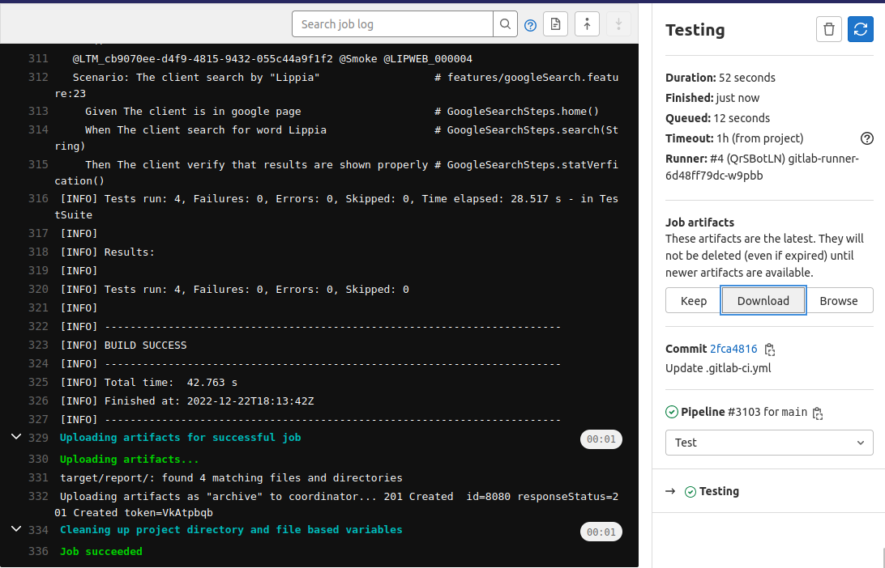

# Pipeline Sample API
 Es un proyecto que tiene como finalidad automatizar el testeo del codigo ingresado al repositorio, utilizando el framework Lippia.

## Consideraciones
El proyecto incluye la imagen de Lippia con todas las herramientas necesarias para los tests que se ejecutan segun donde se haga el commit o el merge:
- Cuando el commit se realiza a main o master el test se ejecuta automaticamente
- Cuando el commit se realiza a otro branch el test se debe ejecutar manualmente

### Como se usa
* Un nuevo commit en el repositorio a las branches "main" o "master" dispara el pipeline automaticamente, iniciando las pruebas pertinentes. Si se desea cambiar esto se puede modificar en la siguiente sección del documento:

```
rules:
    - if: '$CI_COMMIT_BRANCH == "dev" || $CI_COMMIT_BRANCH == "test"'
     #se modifican las ramas, tambien puede eliminarse una o agregar otra
```
* Tambien se pueden modificar las ramas que disparan el pipeline de forma manual en la siguiente seccion del documento:

```
- if: '$CI_COMMIT_BRANCH != "dev" && $CI_COMMIT_BRANCH != "test"'
      when: manual
      #se modifican las ramas, tambien puede eliminarse una o agregar otra
```

* Este pipeline trabaja con la version de lippia 3.1.2.2, en caso de querer modificarla utilizar una imagen desde el siguiente link

>https://hub.docker.com/r/crowdar/lippia/tags


- Antes de disparar el pipeline se deben configurar las siguientes variables de entorno dentro del archivo .gitlab-ci.yml en la siguiente seccion:

```
variables:
        TAG: "@Smoke"
        TESTTYPE: parallel
        LANG: "@EN"
```
- Los valores de dichas variables se encuentran en el archivo POM.xml

  * **TAG**: lleva el nombre de la prueba
  * **TESTTYPE**:  determina el tipo de pruebas a realizar
  * **LANG**: determina el idioma
  
**NOTA:  el pipeline permite modificar o agregar mas variables de entorno dentro del apartado "variables"**

* para realizar las pruebas utilizamos el comando: 
```
$ mvn clean test
```
* En caso de agregar o modificar variables de entorno realizar los cambios necesarios en el script del test en los archivos YAML

### Los reportes son generados en una carpeta llamada **Targets**, que sera generada una vez que la ejecucion de las pruebas haya finalizado.
* El artifact se encuentra para descargar en CI/CD --> Pipelines, dentro del pipeline finalizado, en la parte derecha de la pagina.




**para mas informacion ver [documentacion lippia.](https://github.com/Crowdar/lippia-web-sample-project#getting-started "documentacion lippia.")**
